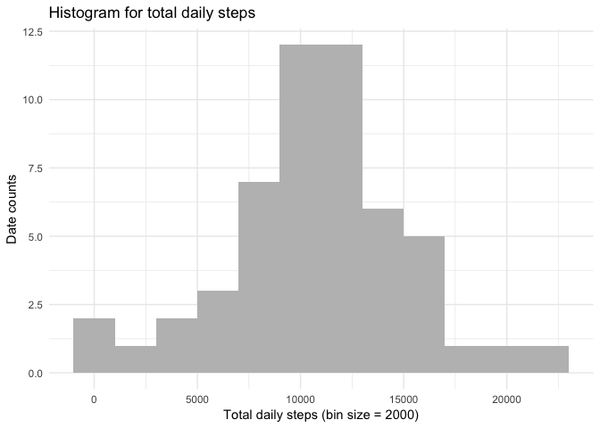
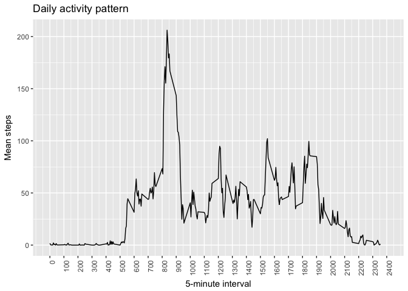
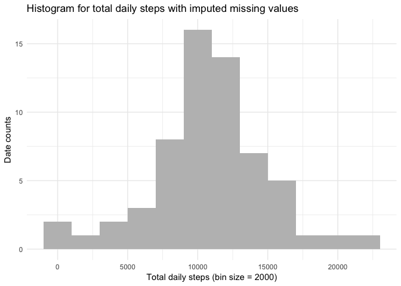
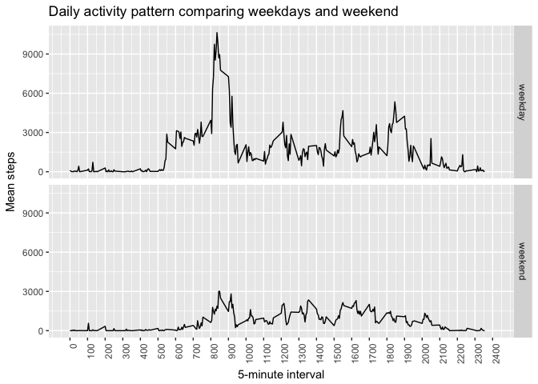

Loading and preprocessing the data
----------------------------------

``` r
knitr::opts_chunk$set(echo = TRUE)
knitr::opts_chunk$set(warning = FALSE)

library(knitr)
library(ggplot2)
library(data.table)
library(mice)
```

    ## Loading required package: lattice

``` r
activity <- read.csv(file = "activity.csv")
activity$date <- as.Date(x = as.character(activity$date), format = "%Y-%m-%d")
activity$interval <- as.factor(activity$interval)
activity <- as.data.table(activity)
```

What is mean total number of steps taken per day?
-------------------------------------------------

``` r
activity_sum <- activity[complete.cases(activity),list(steps = sum(steps)), by = list(date)]

ggplot(data = activity_sum, aes(steps)) +
        theme_minimal() +
        geom_histogram(binwidth = 2000,
                 col=NA, 
                 fill="grey") + 
  labs(title="Histogram for total daily steps", x="Total daily steps (bin size = 2000)", y="Date counts")
```



The mean total daily steps is 10,766 and the median is 10,765.

What is the average daily activity pattern?
-------------------------------------------

``` r
activity_daily <- activity[,list(steps, interval = as.numeric(as.character(interval)))][,list(steps = mean(steps, na.rm =T)), by = list(interval)]
```

In the following chart we can see that the time with the highest activity is in the morning, probably when people are going to work or school. The 5-minute interval with the highest mean steps is 835, which corresponds to 8:35 in the morning. A smaller spike is also seen at 18:00, time when many people leave their work and commute back home.
We can also see that in the nighttime there are virtually no steps.

``` r
ggplot(data = activity_daily, aes(x = interval, y = steps)) +
        geom_line() +
        labs(x = "5-minute interval", y = "Mean steps", title = "Daily activity pattern") +
        scale_x_continuous(breaks = seq(0,2400,by = 100), limits = c(0,2400)) +
        theme(axis.text.x = element_text(angle = 90, hjust = 1))
```



Imputing missing values
-----------------------

``` r
summary(activity)
```

    ##      steps             date               interval    
    ##  Min.   :  0.00   Min.   :2012-10-01   0      :   61  
    ##  1st Qu.:  0.00   1st Qu.:2012-10-16   5      :   61  
    ##  Median :  0.00   Median :2012-10-31   10     :   61  
    ##  Mean   : 37.38   Mean   :2012-10-31   15     :   61  
    ##  3rd Qu.: 12.00   3rd Qu.:2012-11-15   20     :   61  
    ##  Max.   :806.00   Max.   :2012-11-30   25     :   61  
    ##  NA's   :2304                          (Other):17202

``` r
sum(!complete.cases(activity))
```

    ## [1] 2304

There are 2,304 missing values, and all of them belong to the 'steps' variable.

We use the ´mise´package to imput missing values. The strategy used is "predictive mean matching", which predicts a value from a linear model for both missing and observed values, and then the imputation of a subject with a missing value is the observed value of the subject with the nearest predicted value (or random draw of observed values from among the subjects with the nearest predicted values). More information about it can be found [here.](https://statisticalhorizons.com/predictive-mean-matching)

``` r
imputed_data <- mice(activity[,c(1,3),with=F], m=1, maxit = 5, method = 'pmm', seed = 500)
new_activity <- data.table(complete(x = imputed_data, action =  1))
new_activity <- cbind(new_activity, date = activity$date)
```

``` r
new_activity_sum <- new_activity[,list(steps = sum(steps)), by = list(date)]

ggplot(data = new_activity_sum, aes(steps)) +
        theme_minimal() +
        geom_histogram(binwidth = 2000,
                 col=NA, 
                 fill="grey") + 
  labs(title="Histogram for total daily steps with imputed missing values", x="Total daily steps (bin size = 2000)", y="Date counts")
```



``` r
table_comparison <- data.frame(with_missing = c(mean(activity_sum$steps), median(activity_sum$steps)), without_missing = c(mean(new_activity_sum$steps), median(new_activity_sum$steps)))
row.names(table_comparison) <- c("Mean", "Median")

kable(x = table_comparison, digits = 2, col.names = c("With NA", "Imputed NA"), format = "html", format.args = list(big.mark = ","), align = c('l','c','c'))
```

<table>
<thead>
<tr>
<th style="text-align:left;">
</th>
<th style="text-align:left;">
With NA
</th>
<th style="text-align:center;">
Imputed NA
</th>
</tr>
</thead>
<tbody>
<tr>
<td style="text-align:left;">
Mean
</td>
<td style="text-align:left;">
10,766.19
</td>
<td style="text-align:center;">
10,772.05
</td>
</tr>
<tr>
<td style="text-align:left;">
Median
</td>
<td style="text-align:left;">
10,765.00
</td>
<td style="text-align:center;">
10,708.00
</td>
</tr>
</tbody>
</table>
The impact of imputing missing data is negligible when calculating the mean, but it has a 250 daily additional steps in the median.

Are there differences in activity patterns between weekdays and weekends?
-------------------------------------------------------------------------

``` r
new_activity[,wd := as.factor(ifelse(test = weekdays(date,abbreviate = T) %in% c("Sat","Sun"),yes = "weekend",no = "weekday"))]

new_activity_daily_week <- new_activity[,list(steps, wd, interval = as.numeric(as.character(interval)))][,list(steps = sum(steps)), by = list(interval,wd)]

ggplot(data = new_activity_daily_week, aes(x = interval, y = steps)) +
        geom_line() +
        facet_grid(wd~.) +
        labs(x = "5-minute interval", y = "Mean steps", title = "Daily activity pattern comparing weekdays and weekend") +
        scale_x_continuous(breaks = seq(0,2400,by = 100), limits = c(0,2400)) +
        theme(axis.text.x = element_text(angle = 90, hjust = 1))
```



On average, there are less steps in the weekend. Also, the big "morning spike" disappears, very likely because less people work and commute on weekends than on weekdays.
